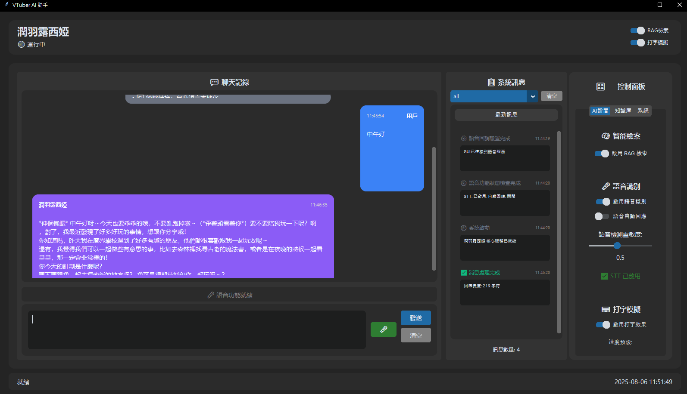
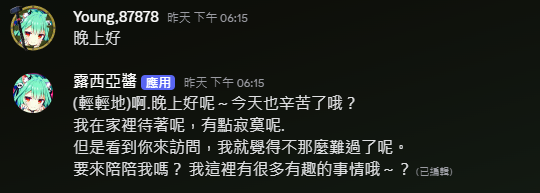

# RushiaLLM - 潤羽露西亞 AI 對話系統

基於 Qwen 模型的露西亞角色 AI 對話系統，支持多種交互方式：  
終端對話、Discord 機器人、圖形界面，以及語音識別功能。

> ⚠️ 以下文件由 AI 產生，可能存在錯誤，實際使用仍需具備一定程式經驗，請以實際狀況為準。

本專案是之前 Rushia AI 的重構升級版，  
打掉全部使用提示詞和 RAG 建置的聊天機器人。  
相較於舊版容易胡言亂語，這個版本已支援多輪會談且更穩定。

目前我還是學生，時間充裕，有問題或建議都可以快速回覆，  
也歡迎加我 Discord、IG 或 FB 直接詢問。

> 與真人潤羽露西亞仍有差距，未來會持續更新、增加更多特性，  
> 期待有一天能成為 AI VTuber (X)

更新紀錄
- 8/27 新增對vllm的支持 在linux上 比原本transformers快了將近30秒上下(原為40秒左右一段話)，不用等很久了


- [Discord](https://discord.gg/UxwTqpvepr)  
- [Facebook](https://www.facebook.com/chen.yang.974808)  
- [Instagram](https://www.instagram.com/young20160124/)
## ✨ 主要特色

- 🎭 **角色扮演**: 基于露西亞人格的AI對話系統
- 🗣️ **語音識別**: 支持即時語音轉文字(STT)，可語音輸入對話
- 🧠 **RAG知識庫**: 支持文檔上傳和知識檢索，讓AI更智能
- 💬 **多種界面**: 終端、Discord機器人、現代化GUI界面
- ⚡ **智能優化**: 打字模擬效果、智慧換行、簡繁轉換
- 🔧 **高度可配置**: 支援GPU加速、模型參數調整、系統優化
- 🔧 **雙底層架構**: 支援多GPU，vllm或transformers供使用(✨linux才能使用vllm部署)




## 🚀 快速開始

**重要提醒:**
- 🎯 **GPU顯存至少需要16GB**，推薦16GB以上
- 💾 模型文件約11GB 總佔用大概10.9-11
- ✨linux才能使用vllm部署

### 環境要求

- **作業系統**: Windows 10/11 (主要支持)、Linux (實驗性)
- **Python**: 3.8-3.11 (建議3.10)
- **CUDA**: 11.8+ / 12.x (GPU加速必需)
- **驅動程式**: NVIDIA GeForce 驅動 520.61+
- NVIDIA GPU (建議16GB+ VRAM 4060ti 16G 4070 等)
- 16GB+ RAM

### 安裝步驟

#### 1. 安裝CUDA (GPU加速必需)

**自動安裝方式:**
```bash
# 使用python安裝CUDA (推薦)
pip install pytorch torchvision torchaudio pytorch-cuda=12.1 -c pytorch -c nvidia
```

**手動安裝方式:**
1. 前往 [NVIDIA CUDA官網](https://developer.nvidia.com/cuda-downloads)
2. 選擇作業系統版本下載CUDA Toolkit 12.1
3. 安裝完成後驗證：
```bash
nvcc --version
nvidia-smi  # 查看GPU狀態
```

**驗證安裝:**
```python
import torch
print(f"CUDA可用: {torch.cuda.is_available()}")
print(f"CUDA版本: {torch.version.cuda}")
print(f"GPU數量: {torch.cuda.device_count()}")
```

#### 2. 建立虛擬環境 (強烈建議)

**使用venv:**
```bash
# 創建虛擬環境
python -m venv rushia_ai_env

# 啟動虛擬環境
# Windows:
rushia_ai_env\Scripts\activate
# Linux/Mac:
source rushia_ai_env/bin/activate

# 升級pip
python -m pip install --upgrade pip
```

#### 3. 克隆專案
```bash
git clone https://github.com/young878787/RushiaLLM.git
cd RushiaLLM/scripts/RushiaModeV2/scrpitsV2/LLM
```

#### 4. 安裝依賴
```bash
# 確保虛擬環境已啟動
pip install -r requirements.txt

# 如果遇到音頻依賴問題 (Windows)
pip install pipwin
pipwin install pyaudio

# 驗證關鍵依賴
python -c "import torch; print('PyTorch:', torch.__version__)"
python -c "import transformers; print('Transformers:', transformers.__version__)"
python -c "import RealtimeSTT; print('RealtimeSTT: OK')"
```

3. **下載模型**

**方式一：自動下載 (推薦)**
```bash
# 使用Hugging Face CLI
pip install huggingface_hub
huggingface-cli download Qwen/Qwen3-8B --local-dir models/Qwen3-8B
huggingface-cli download Qwen/Qwen3-Embedding-0.6B --local-dir models/Qwen3-Embedding-0.6B
```

**方式二：手動下載**
- 前往 [Hugging Face](https://huggingface.co/)
- 下載 `Qwen/Qwen3-8B` 到 `models/Qwen3-8B/`
- 下載 `Qwen/Qwen3-Embedding-0.6B` 到 `models/Qwen3-Embedding-0.6B/`

**驗證模型:**
```bash
python -c "
from transformers import AutoTokenizer
tokenizer = AutoTokenizer.from_pretrained('models/Qwen3-8B')
print('✅ 模型載入成功')
"
```

4. **初始化資料庫**
```bash
# 創建必要目錄
mkdir -p data/vectordb data/docs data/cache logs

# 初始化ChromaDB向量資料庫 (首次運行自動創建)
python -c "
import chromadb
client = chromadb.PersistentClient(path='./data/vectordb')
print('✅ 向量資料庫初始化完成')
"
```

5. **配置設定**
   - 編輯 `config.yaml` 調整模型路徑和參數
   - Discord機器人需要創建 `.env` 文件設置TOKEN

## 🎯 使用方式

### 1. 終端對話介面
最簡單的對話方式，適合開發和測試：

```bash
python main.py
```

**功能特色:**
- 即時AI對話
- RAG知識庫查詢
- 打字模擬效果
- 對話記憶管理

### 2. Discord 機器人
將AI部署到Discord伺服器：

```bash
python discord_bot.py
```

**設置步驟:**
1. 創建Discord應用程序和機器人
2. 創建 `.env` 文件：
```env
DISCORD_TOKEN=your_bot_token_here
DISCORD_GUILD_ID=your_guild_id_here  # 可選
```
3. 邀請機器人到伺服器並運行

**Discord功能:**
- 在頻道中與AI對話
- 支援語音識別(需配置STT)
- 知識庫管理指令
- 多用戶對話記憶

### 3. GUI 圖形界面
現代化的桌面應用程序：

```bash
python gui_launcher.py
```

**GUI功能模組:**
- 💬 **聊天室**: 支持打字模擬效果的對話界面
- 🧠 **RAG控制**: 一鍵切換知識庫檢索
- 📚 **文檔管理**: 拖拽上傳文檔到知識庫
- 🔍 **知識搜索**: 測試知識庫搜索功能
- ⚙️ **系統監控**: 查看模型和系統狀態
- 🎛️ **智能控制**: 打字速度、換行、簡繁轉換設置
- 🎤 **語音輸入**: 實時語音轉文字，支持預覽功能

## 🏗️ 專案結構

```
scrpitsV2/LLM/
├── 📋 主要程序
│   ├── main.py                    # 終端對話介面
│   ├── discord_bot.py             # Discord機器人
│   ├── gui_launcher.py            # GUI啟動器
│   └── config.yaml                # 系統配置文件
│
├── 🎯 核心源碼 (src/)
│   ├── core_service.py            # 核心服務層，統一AI邏輯
│   ├── llm_manager/               # LLM模型管理器
│   │   ├── gpu_manager.py         # GPU管理器 多卡
│   │   ├── llm_manger.py          # 調用llm的核心
│   │   ├── model_loader.py        # transformers載入模型器
│   │   ├── vllm_model_loader.py   # vllm載入模型器
│   │   └── response_generator.py  # 回應生成器
│   ├── rag_system.py              # RAG知識庫系統
│   ├── STT.py                     # 語音識別服務
│   ├── core.py                    # 露西亞人格核心
│   ├── utils/                     # 工具模組
│   │   ├── logger.py              # 日誌系統
│   │   ├── system_optimizer.py    # 系統優化
│   │   └── config_manager.py      # 配置管理
│   └── filter/                    # 文字處理過濾器
│       ├── smart_line_break_filter.py
│       └── traditional_chinese_filter.py
│
├── 🖥️ GUI界面 (gui/)
│   ├── __init__.py                # GUI主入口
│   ├── main_window.py             # 主視窗
│   ├── chat_components.py         # 聊天組件
│   ├── control_components.py      # 控制面板
│   ├── document_components.py     # 文檔管理
│   ├── system_components.py       # 系統監控
│   ├── event_handlers.py          # 事件處理
│   └── gui_utils                  # GUI工具
│       ├── async_helper           # 異步處理
│       └── thread_safe_gui        # 線程安全
│
├── 🧠 知識庫與資料
│   ├── rushia_wiki/               # 露西亞知識庫
│   ├── data/                      # 資料目錄
│   │   ├── vectordb/              # 向量資料庫
│   │   ├── docs/                  # 上傳文檔
│   │   └── cache/                 # 快取目錄
│   └── logs/                      # 系統日誌
│
└── 🤖 AI模型 (models/)
    ├── Qwen3-8B/                  # 主要對話模型
    └── Qwen3-Embedding-0.6B/      # 嵌入模型
```

## ⚙️ 配置說明

### 主要配置項目 (config.yaml)

```yaml
# 模型配置
models:
  llm:
    model_path: "models/Qwen3-8B"     # LLM模型路徑
    device: "cuda"                    # 設備: cuda/cpu
    quantization: "4bit"              # 量化: 4bit/8bit/none

# RAG知識庫
rag:
  vector_db:
    type: "chroma"                    # 向量資料庫類型
    persist_directory: "./data/vectordb"

# STT語音識別
stt:
  enabled: true                      # 啟用語音識別
  auto_response: false               # 自動回應語音
  language: "zh-TW"                  # 識別語言
  auto_stop_after_transcription: true # 識別後自動停止
```

## 🎤 語音功能設置

系統支援即時語音識別，可以語音輸入與AI對話：

1. **啟用語音功能**: 在GUI中開啟STT開關
2. **語音輸入**: 點擊麥克風按鈕開始語音輸入
3. **即時預覽**: 語音轉文字結果會即時顯示
4. **自動停止**: 識別完成後自動停止錄音

**語音設置:**
- 支援中文(繁體/簡體)、英文、日文等多種語言
- 可調整語音檢測靈敏度
- 支援GPU加速語音識別

## 🗄️ 資料庫系統

### 向量資料庫 (ChromaDB)
系統使用ChromaDB作為向量資料庫，用於儲存和檢索文檔內容：

**功能特點:**
- 🔍 **向量搜索**: 語義相似度搜索，理解文檔含義
- 📚 **文檔管理**: 自動分割、索引和管理上傳的文檔
- 💾 **持久化存儲**: 資料永久保存在本地
- ⚡ **快速檢索**: 支援大量文檔的快速檢索

**資料庫結構:**
```
data/vectordb/
├── chroma.sqlite3          # ChromaDB主資料庫
├── index/                  # 向量索引檔案
└── data_level0.bin         # 向量數據檔案
```

**支援的文檔格式:**
- 📄 **純文字**: .txt, .md
- 📘 **Word文檔**: .docx
- 📕 **PDF檔案**: .pdf  
- 🌐 **網頁內容**: HTML解析

**資料庫管理:**
```bash
# 查看資料庫狀態
python -c "
import chromadb
client = chromadb.PersistentClient(path='./data/vectordb')
collection = client.get_collection('vtuber_knowledge')
print(f'文檔數量: {collection.count()}')
"

# 清空資料庫 (謹慎使用)
python -c "
import shutil
shutil.rmtree('./data/vectordb')
print('資料庫已清空')
"
```

### 對話記憶管理
- 每個用戶獨立的對話歷史
- 自動清理過期對話記憶
- 支援手動清除特定用戶記憶

### 系統快取
```
data/cache/
├── model_cache/            # 模型快取
├── embedding_cache/        # 嵌入向量快取  
└── temp_files/            # 臨時檔案
```

## 🔧 進階功能

### 智能對話效果
- **打字模擬**: 模擬真實打字速度，支持多種預設
- **智慧換行**: 自動調整文字排版
- **簡繁轉換**: 支援簡體中文轉繁體

### 系統優化
- **Windows優化**: 自動調整系統設置提升性能
- **記憶體管理**: 智能管理對話歷史和快取
- **GPU加速**: 支援CUDA加速模型推理

### 多用戶支援
- 每個用戶獨立的對話記憶
- 可配置對話歷史長度
- 支援清除特定用戶記憶

## 📊 系統監控

GUI提供完整的系統狀態監控：
- 模型資訊和資源使用
- RAG知識庫統計
- 語音識別狀態
- 對話統計和效能數據

## 🐛 故障排除

### 常見問題

1. **GPU記憶體不足**
   ```
   CUDA out of memory
   ```
   **解決方案:**
   - 關閉其他GPU占用程序
   - 降低batch_size或max_length
   - 使用CPU模式 (修改config.yaml中device為"cpu")

2. **模型載入失敗**
   ```
   FileNotFoundError: models/Qwen3-8B
   ```
   **解決方案:**
   - 檢查模型路徑是否正確
   - 確認模型檔案完整下載
   - 檢查config.yaml中的路徑設定

3. **CUDA相關錯誤**
   ```
   RuntimeError: CUDA driver version is insufficient
   ```
   **解決方案:**
   - 更新NVIDIA顯卡驅動至最新版本
   - 重新安裝CUDA Toolkit
   - 檢查PyTorch CUDA版本是否匹配

4. **語音識別無反應**
   **解決方案:**
   - 檢查麥克風權限和設備連接
   - 確認STT服務已啟用
   - 檢查Windows隱私設置中的麥克風權限

5. **ChromaDB資料庫錯誤**
   ```
   chromadb.errors.InvalidCollectionException
   ```
   **解決方案:**
   - 刪除 `data/vectordb` 資料夾重新初始化
   - 檢查磁碟空間是否充足
   - 確認資料庫檔案權限

6. **記憶體使用過高**
   **解決方案:**
   - 定期清理對話記憶
   - 調整 `max_history_length` 參數
   - 關閉不需要的功能模組

7. **虛擬環境相關問題**
   ```
   ModuleNotFoundError: No module named 'xxx'
   ```
   **解決方案:**
   - 確認虛擬環境已正確啟動
   - 重新安裝requirements.txt中的依賴
   - 檢查Python版本是否正確

### 日誌檢查
```bash
# 查看最新日誌
tail -f logs/vtuber_ai.log

# Windows用戶可以直接查看檔案
notepad logs/vtuber_ai.log

# 查看系統資源使用
python -c "
import psutil
print(f'CPU: {psutil.cpu_percent()}%')
print(f'記憶體: {psutil.virtual_memory().percent}%')
print(f'GPU: 使用nvidia-smi指令查看')
"
```

### 效能調優

**GPU優化:**
- 使用混合精度訓練 (fp16)
- 調整batch_size適應顯存
- 啟用CUDA記憶體快取

**CPU優化 (無GPU時):**
```yaml
# 修改config.yaml
models:
  llm:
    device: "cpu"
    quantization: "none"  # CPU不建議量化
```

**記憶體優化:**
- 定期清理向量資料庫
- 限制對話歷史長度
- 適當調整chunk_size

## 📝 開發說明

### 添加新功能
1. 在 `src/` 中實現核心邏輯
2. 在 `core_service.py` 中添加統一接口
3. 在對應的GUI組件中添加界面

### 自定義角色
1. 修改 `rushia_wiki/` 中的知識庫內容
2. 調整 `core.py` 中的人格設定
3. 更新 `config.yaml` 中的角色配置

## 🤝 貢獻指南

歡迎提交Issue和Pull Request！

1. Fork本專案
2. 創建特性分支 (`git checkout -b feature/AmazingFeature`)
3. 提交更改 (`git commit -m 'Add some AmazingFeature'`)
4. 推送到分支 (`git push origin feature/AmazingFeature`)
5. 開啟Pull Request

## 📄 授權

本專案採用MIT授權 - 詳見 [LICENSE](LICENSE) 文件

## 💖 致謝

- 感謝Qwen團隊提供優秀的開源模型
- 感謝RealtimeSTT提供語音識別支援
- 感謝所有貢獻者和使用者的支持

---

**享受與露西亞的AI對話吧！** 🌸
